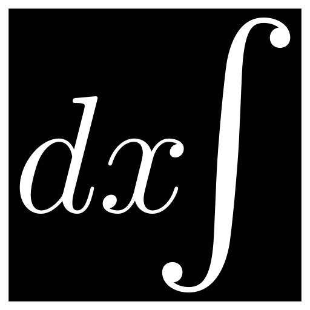

<div align="center">

# ihateintegrals


</div>

<br/>
<br/>
<br/>

An open source computer algebra system focused on solving frustrating integrals.
Comes with a [website](https://ihateintegrals.com).

## Getting Started

These instructions will get you a copy of the project up and running on your
local machine for development and testing purposes. See deployment for notes on
how to deploy the project on a live system.

### Prerequisites

To build the library in `cas` you Rust installed. To build the website, you
additionally need npm and jest.

### Installing

Build the library:

```bash
cd cas
cargo build
```

Run the cas cli test tool:

```bash
cd ihateintegrals
echo "[\"Integral\", [\"Divide\", [\"Sum\", [\"Product\", {\"num\": 3}, [\"Exponent\", {\"var\": \"x\"}, {\"num\": 2}]], {\"var\": \"x\"}, {\"num\": 2}], [\"Divide\", {\"num\": 1}, [\"Product\", {\"num\": 2}, {\"var\": \"x\"}]]], {\"var\": \"x\"}]
" | cargo run -- --depth 20 --report-statistics --max-derivations 5000
```

Build the website:

```bash
npm run build
npm run serve # Starts local dev server at localhost:8080
```

## Running the tests

Explain how to run the automated tests for this system

Tests for the website are run with `npm run test`. The library is tested with
the `cargo test` command.

### CAS Library Tests

The cas system has many unit tests which are run with `cargo test`. There are
also integration tests which verify that the capabilities of the derivation
process as a whole do not degrade during optimization which is still happening.
These are run with `cargo test --test '*'`.

## Built With

-   [Rust](https://www.rust-lang.org/) - Library language
-   [TypeScript](https://www.typescriptlang.org/) - Website typing
-   [MathQuill](http://mathquill.com/) - Latex expression input
-   [MathJax](https://www.mathjax.org/) - Math rendering

## Contributing

This project is in a very early stage and contributions probably won't be helpful.

## License

This project is licensed under the MIT License - see the
[LICENSE.md](LICENSE.md) file for details
